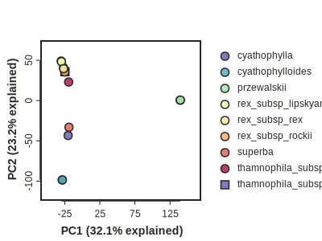
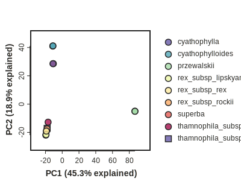

# pca

The `ipyrad2 pca` tool makes it easy to extract a filtered unlinked SNP sites from an assembled dataset,
apply imputation to fill missing cells, fit a dimensionality reduction model (e.g., PCA, t-SNE, UMAP),
and visualize the results.

This tutorial provides a detailed explanation of this tools workflow and the effects of parameter options.
For a quick demonstration of the pca tool you may wish to jump straight to the [Empirical example](#empirical-example)
at the bottom of the page.

## When to Use

Use `ipyrad2 pca` when you want:

- principal component coordinates from filtered SNP data
- quick nonlinear embeddings with t-SNE or UMAP from the same filtered input logic
- per-sample missing-data and imputation summaries alongside the numerical output

`pca` is usually the best first pass. `tsne` and `umap` are useful when you want exploratory embeddings, and
to reduce higher dimensional data to 2D plots, but they are more sensitive to parameter choices and should
be interpreted more cautiously.


## Prerequisites

- the ipyrad2 analysis tools installed: `conda install ipyrad2[analysis] -c conda-forge -c bioconda`
- a SNP-capable HDF5 file produced by `assemble` or `analysis vcf-to-hdf5`
- enough retained samples and SNPs after filtering to support the selected method

## Inputs and Filtering

The shared filtering and sample-selection controls are:

- `-m, --min-sample-coverage`: minimum number of samples with data required at a SNP
- `-r, --max-sample-missing`: drop samples whose missing-data fraction exceeds this threshold, then rerun SNP filtering
- `-a, --min-minor-allele-frequency`: remove low-frequency SNPs after coverage filtering
- `-e, --exclude`: exclude one or more named samples
- `-R, --include-reference`: include `assembly_reference_sequence`
- `-i, --imap`: sample-to-population map for filtering and imputation grouping
- `-g, --minmap`: per-population minimum coverage checks applied on top of `-m` when `imap` is used

By default the command subsamples one SNP per RAD locus. Use `--no-subsample` to keep linked SNPs.

`--seed` affects SNP subsampling, imputation, and method initialization. For PCA replicates, ipyrad2 derives deterministic per-replicate seeds from the base seed.

## Methods

`-M, --method` chooses one of three methods:

- `pca`: principal components analysis
- `tsne`: t-SNE embedding
- `umap`: UMAP embedding

Current method-specific controls are:

- `--replicates`: only valid with `-M pca`
- `--plot`: only valid with `-M pca`
- `--perplexity` and `--max-iter`: only used with `-M tsne`
- `--n-neighbors`: only used with `-M umap`

Important current rules:

- only the PCA method supports running and visualizing multiple replicates
- PCA plotting in the command line currently supports only the first two principal components (TODO: expand plotting options)
<!--
For t-SNE:

- `perplexity` must be greater than zero
- `perplexity` must be smaller than the number of retained samples
- `max_iter` must be at least 250

For UMAP:

- `n_neighbors` must be at least 2
-->

## Imputation and Missing Data

All PCA-family methods in ipyrad2 require a fully imputed genotype matrix. Missing genotypes are not allowed to remain in the numerical matrix passed to PCA, t-SNE, or UMAP.

Supported imputation modes are:

- `sample`: sample missing diploid genotypes from allele frequencies within each imputation group
- `zero-fill`: replace missing genotypes with homozygous reference calls
- TODO: add kmeans clustering method

`sample` is the default and generally the preferred choice. If you provide `imap`, sample-mode imputation uses those groups. If you do not provide `imap`, all retained samples are treated as one imputation group.

`zero-fill` is usually a poor default for exploratory structure analyses because it can pull missing-heavy samples toward the reference state.

Users should inspect `sample_data_summary.tsv` after every run and consider dropping samples that require too much imputation before trusting the structure. Heavy imputation is often a warning that missingness, rather than biology, may be shaping the ordination.

## How ipyrad2 PCA-Family Works

The active implementation is:

1. filter the SNP HDF5 to extract SNPs that pass filtering thresholds
2. optionally subsample a single SNP per locus (i.e., unlinked SNP view)
3. impute the genotype matrix
4. run the chosen numerical method on the imputed matrix
5. write coordinates and summary tables
6. optionally generate a plot

Method-specific details:

- `pca`: uses a direct SVD-based PCA on the centered matrix and writes explained-variance ratios
- `tsne`: uses scikit-learn t-SNE with `init="pca"`
- `umap`: uses `umap-learn` UMAP with `init="spectral"`

PCA replicates are mainly useful when the selected SNP view can change across replicates, especially under
one-SNP-per-locus subsampling and stochastic imputation. PCA itself is otherwise deterministic for a fixed matrix.
Plotting performed on PCA replicates shows low opacity results for all replicates, and a high opacity points for
the centroid of each sample across replicates.

## Outputs

Every run writes:

- `<name>.coords.tsv`
- `<name>.sample_data_summary.tsv`
- `<name>.stats.txt`

PCA runs additionally write:

- `<name>.variance.tsv`

If you add `--plot`, PCA also writes:

- `<name>.plot.svg`

### `coords.tsv`

This table contains one row per sample per replicate and can be used to generate a plot.

### `sample_data_summary.tsv`

This table records per-sample missingness and imputation information. Examining it can help you decide whether
some samples should be excluded, and whether to try different parameter options.

For PCA with multiple replicates, the numeric columns in this file are averaged across replicates. The imputation algorithm column stays constant.

### `variance.tsv`

This file is written only for `-M pca`. It contains `replicate`, `axis`, `explained_variance_ratio`. t-SNE and UMAP do not write a variance file.

### `plot.svg`

This file is written only when you use `--plot` with `-M pca`.

- it is a default SVG scatter plot of `PC1` versus `PC2`
- the plotting axes are drawn with an external-tick style and a boxed outline
- points are colored by `imap` group, or by the default `all` group if no `imap` is provided
- single-replicate runs show one point per sample
- multi-replicate runs show translucent replicate clouds plus one centroid per sample

This plot is meant as a quick first look, not a replacement for checking the coordinate tables directly.
[Coming soon: API instructions for more detailed plotting.]

### `stats.txt`

This is a human-readable summary file. It includes all of the information necessary to repeat the analysis:

- tool name and input file
- initial, dropped, and retained samples
- `imap`, `minmap`, and reference-inclusion settings
- whether SNPs were subsampled
- random seed
- imputation method
- selected method and replicate count
- exported SNP and linkage-block counts
- number of axes written
- imputation algorithm plus imputed SNP and genotype fractions
- `perplexity`, `max_iter`, or `n_neighbors` when relevant
- shared SNP-extracter filter statistics

## Method Interpretation Notes

### PCA

PCA is usually the most stable and interpretable first pass.

- axis directions are based on variance in the imputed genotype matrix
- `variance.tsv` helps you judge how much structure each principal component explains
- multiple PCA replicates are mainly useful for sensitivity checks, especially when SNP subsampling changes the input matrix

### t-SNE

t-SNE is an exploratory embedding, not a variance-partitioning method.

- distances and cluster spacing are not directly comparable to PCA axes
- the result can change noticeably with `perplexity`, sample count, and imputation
- there is no explained-variance table for t-SNE

### UMAP

UMAP is also an exploratory embedding.

- local and global structure can shift with `n_neighbors`
- the embedding may emphasize visual separation that should not be over-interpreted biologically
- there is no explained-variance table for UMAP

For both t-SNE and UMAP, heavy missing-data imputation deserves extra caution because nonlinear embeddings can amplify preprocessing effects.

## Command Patterns

Basic PCA run:

```bash
ipyrad2 analysis pca \
  -d snps.hdf5 \
  -o PCA_OUT
```

Run PCA and write the default SVG plot:

```bash
ipyrad2 analysis pca \
  -d snps.hdf5 \
  -o PCA_OUT \
  --plot
```

Run PCA replicates on the default unlinked SNP view:

```bash
ipyrad2 analysis pca \
  -d snps.hdf5 \
  -o PCA_OUT \
  --replicates 3 \
  --seed 7
```

Run t-SNE:

```bash
ipyrad2 analysis pca \
  -d snps.hdf5 \
  -o TSNE_OUT \
  -M tsne \
  --perplexity 8 \
  --max-iter 1000
```

Run UMAP:

```bash
ipyrad2 analysis pca \
  -d snps.hdf5 \
  -o UMAP_OUT \
  -M umap \
  --n-neighbors 10
```

Keep linked SNPs and explicitly request zero-fill imputation:

```bash
ipyrad2 analysis pca \
  -d snps.hdf5 \
  -o PCA_OUT \
  --no-subsample \
  --impute-method zero-fill
```

Use population-aware filtering and sample-mode imputation groups:

```bash
ipyrad2 analysis pca \
  -d snps.hdf5 \
  -o PCA_OUT \
  -i pops.tsv \
  -g minmap.tsv
```


## Common Failures

- Wrong input type: `analysis pca` expects SNP-capable HDF5, not raw VCF.
- Empty or too-small result after filtering: all methods require at least two retained samples and at least one retained SNP.
- Invalid replicate count: PCA replicates must be at least 1, and t-SNE or UMAP only support one run.
- Invalid t-SNE settings: perplexity must be positive and smaller than the number of retained samples, and `max_iter` must be at least 250.
- Invalid UMAP settings: `n_neighbors` must be at least 2.
- Invalid plotting request: `--plot` currently works only with `-M pca`.
- Existing output files: use `--force` to overwrite an existing result set.
- Missing dependencies: scikit-learn is required for all methods, `umap-learn` is additionally required for UMAP, and `toyplot` is only required when `--plot` is requested.


## Empirical example

This example demonstrates the `ipyrad2 pca` tool applied to the empirical dataset from the [SE denovo tutorial]().
It uses the following IMAP file that maps each sample in the dataset to a population/taxon name.

```literal
32082_przewalskii       przewalskii
33588_przewalskii       przewalskii
29154_superba           superba
30686_cyathophylla      cyathophylla
41954_cyathophylloides  cyathophylloides
41478_cyathophylloides  cyathophylloides
33413_thamno            thamnophila_subsp_cupuliformis
30556_thamno            thamnophila_subsp_thamnophila
35855_rex               rex_subsp_rex
40578_rex               rex_subsp_rex
35236_rex               rex_subsp_rockii
38362_rex               rex_subsp_lipskyana
39618_rex               rex_subsp_lipskyana
```

### pca with min sample filtering

Here let's filter this denovo assembled dataset to keep all variant sites that have data for >= 8 samples,
and let's exclude any sample that has missing data for >90% of sites.

```bash
ipyrad2 pca \
  -d SRP021469/OUT/assembly.hdf5 \
  -o SRP021469/output-pca \
  -n assembly_min8 \
  -m 8 \
  -r 0.90 \
  --plot \
  --imap SRP021469/IMAP.txt
```

??? info "logging report"

    ```
    2026-07-20 20:38:02 | INFO     | cli_analysis.py      | -------------------------------------------------
    2026-07-20 20:38:02 | INFO     | cli_analysis.py      | ---- ipyrad2 pca: numerical PCA-family methods ----
    2026-07-20 20:38:02 | INFO     | cli_analysis.py      | -------------------------------------------------
    2026-07-20 20:38:02 | INFO     | cli_analysis.py      | CMD: ipyrad2 pca -d SRP021469/OUT/assembly.hdf5 -o SRP021469/output-pca -n assembly_min8 -m 8 -r 0.90
    2026-07-20 20:38:11 | INFO     | snps_extracter.py    | SNP extraction summary
    2026-07-20 20:38:11 | INFO     | snps_extracter.py    | filter statistic samples: 13
    2026-07-20 20:38:11 | INFO     | snps_extracter.py    | filter statistic pre_filter_snps: 204914
    2026-07-20 20:38:11 | INFO     | snps_extracter.py    | filter statistic pre_filter_percent_missing: 31.497 (linked genotype cells missing before site filtering)
    2026-07-20 20:38:11 | INFO     | snps_extracter.py    | filter statistic masked_genotypes_by_min_depth: 0
    2026-07-20 20:38:11 | INFO     | snps_extracter.py    | filter statistic filter_by_indels_present: 0
    2026-07-20 20:38:11 | INFO     | snps_extracter.py    | filter statistic filter_by_non_biallelic: 6773
    2026-07-20 20:38:11 | INFO     | snps_extracter.py    | filter statistic filter_by_mincov: 68550
    2026-07-20 20:38:11 | INFO     | snps_extracter.py    | filter statistic filter_by_minmap: 68550
    2026-07-20 20:38:11 | INFO     | snps_extracter.py    | filter statistic filter_by_min_site_qual: 0
    2026-07-20 20:38:11 | INFO     | snps_extracter.py    | filter statistic filter_by_invariant_after_subsampling: 21183
    2026-07-20 20:38:11 | INFO     | snps_extracter.py    | filter statistic filter_by_minor_allele_frequency: 0
    2026-07-20 20:38:11 | INFO     | snps_extracter.py    | filter statistic post_filter_snps: 121676
    2026-07-20 20:38:11 | INFO     | snps_extracter.py    | filter statistic post_filter_snp_containing_linkage_blocks: 28085
    2026-07-20 20:38:11 | INFO     | snps_extracter.py    | filter statistic post_filter_percent_missing: 16.977 (linked post-filter genotype cells missing before optional subsampling)
    2026-07-20 20:38:11 | INFO     | common.py            | pca SNP imputation: algorithm=sample prepared_matrix_scope=subsampled_unlinked (one SNP per linkage block selected for the downstream method) snp_columns_with_missing=23486/28085 (83.6%) missing_genotype_cells=63965/365105 (17.5%)
    2026-07-20 20:38:11 | INFO     | common.py            | pca prepared SNP summary: prepared_matrix_scope=subsampled_unlinked (one SNP per linkage block selected for the downstream method) samples=13 linked_post_filter_snps=121676 linked_post_filter_snp_containing_linkage_blocks=28085 prepared_snps=28085 prepared_snp_containing_linkage_blocks=28085 subsample=True
    2026-07-20 20:38:11 | INFO     | pca.py               | wrote PCA-family coordinates to /home/deren/Documents/tools/ipyrad2/SRP021469/output-pca/assembly_min8.coords.tsv
    2026-07-20 20:38:11 | INFO     | pca.py               | wrote PCA-family sample data summary to /home/deren/Documents/tools/ipyrad2/SRP021469/output-pca/assembly_min8.sample_data_summary.tsv
    2026-07-20 20:38:11 | INFO     | pca.py               | wrote PCA explained variance to /home/deren/Documents/tools/ipyrad2/SRP021469/output-pca/assembly_min8.variance.tsv
    2026-07-20 20:38:11 | INFO     | pca.py               | wrote PCA-family stats to /home/deren/Documents/tools/ipyrad2/SRP021469/output-pca/assembly_min8.stats.txt
    ```

This generates the plot shown below:



### pca with minmap filtering

To apply a minmap filter use this MINMAP file that assigns a minimum number of samples that must
be present for each population in the IMAP file.

```literal
przewalskii                     1
superba                         1
cyathophylla                    1
cyathophylloides                1
thamnophila_subsp_cupuliformis  1
thamnophila_subsp_thamnophila   1
rex_subsp_rex                   1
rex_subsp_rockii                1
rex_subsp_lipskyana             1
```

Then run `pca` using an imap/minmap filter and with a different output name.

```bash
ipyrad2 pca \
  -d SRP021469/OUT/assembly.hdf5 \
  -o SRP021469/output-pca \
  -n assembly_imap \
  --plot \
  --imap SRP021469/IMAP.txt \
  --minmap SRP021469/MINMAP.txt
```

??? info "logging report"

    ```
    2026-07-20 21:02:38 | INFO     | cli_analysis.py      | -------------------------------------------------
    2026-07-20 21:02:38 | INFO     | cli_analysis.py      | ---- ipyrad2 pca: numerical PCA-family methods ----
    2026-07-20 21:02:38 | INFO     | cli_analysis.py      | -------------------------------------------------
    2026-07-20 21:02:38 | INFO     | cli_analysis.py      | CMD: ipyrad2 pca -d SRP021469/OUT/assembly.hdf5 -o SRP021469/output-pca -n assembly_minmap -r 0.90 --plot --imap SRP021469/IMAP.txt --minmap SRP021469/MINMAP.txt
    2026-07-20 21:02:47 | INFO     | snps_extracter.py    | SNP extraction summary
    2026-07-20 21:02:47 | INFO     | snps_extracter.py    | filter statistic samples: 13
    2026-07-20 21:02:47 | INFO     | snps_extracter.py    | filter statistic pre_filter_snps: 204914
    2026-07-20 21:02:47 | INFO     | snps_extracter.py    | filter statistic pre_filter_percent_missing: 31.497 (linked genotype cells missing before site filtering)
    2026-07-20 21:02:47 | INFO     | snps_extracter.py    | filter statistic masked_genotypes_by_min_depth: 0
    2026-07-20 21:02:47 | INFO     | snps_extracter.py    | filter statistic filter_by_indels_present: 0
    2026-07-20 21:02:47 | INFO     | snps_extracter.py    | filter statistic filter_by_non_biallelic: 6773
    2026-07-20 21:02:47 | INFO     | snps_extracter.py    | filter statistic filter_by_mincov: 1585
    2026-07-20 21:02:47 | INFO     | snps_extracter.py    | filter statistic filter_by_minmap: 170096
    2026-07-20 21:02:47 | INFO     | snps_extracter.py    | filter statistic filter_by_min_site_qual: 0
    2026-07-20 21:02:47 | INFO     | snps_extracter.py    | filter statistic filter_by_invariant_after_subsampling: 21183
    2026-07-20 21:02:47 | INFO     | snps_extracter.py    | filter statistic filter_by_minor_allele_frequency: 0
    2026-07-20 21:02:47 | INFO     | snps_extracter.py    | filter statistic post_filter_snps: 33050
    2026-07-20 21:02:47 | INFO     | snps_extracter.py    | filter statistic post_filter_snp_containing_linkage_blocks: 7612
    2026-07-20 21:02:47 | INFO     | snps_extracter.py    | filter statistic post_filter_percent_missing: 3.404 (linked post-filter genotype cells missing before optional subsampling)
    2026-07-20 21:02:47 | INFO     | common.py            | pca SNP imputation: algorithm=sample prepared_matrix_scope=subsampled_unlinked (one SNP per linkage block selected for the downstream method) snp_columns_with_missing=2823/7612 (37.1%) missing_genotype_cells=3310/98956 (3.3%)
    2026-07-20 21:02:47 | INFO     | common.py            | pca prepared SNP summary: prepared_matrix_scope=subsampled_unlinked (one SNP per linkage block selected for the downstream method) samples=13 linked_post_filter_snps=33050 linked_post_filter_snp_containing_linkage_blocks=7612 prepared_snps=7612 prepared_snp_containing_linkage_blocks=7612 subsample=True
    2026-07-20 21:02:47 | INFO     | pca.py               | wrote PCA-family coordinates to /home/deren/Documents/tools/ipyrad2/SRP021469/output-pca/assembly_minmap.coords.tsv
    2026-07-20 21:02:47 | INFO     | pca.py               | wrote PCA-family sample data summary to /home/deren/Documents/tools/ipyrad2/SRP021469/output-pca/assembly_minmap.sample_data_summary.tsv
    2026-07-20 21:02:47 | INFO     | pca.py               | wrote PCA explained variance to /home/deren/Documents/tools/ipyrad2/SRP021469/output-pca/assembly_minmap.variance.tsv
    2026-07-20 21:02:47 | INFO     | pca.py               | wrote PCA SVG plot to /home/deren/Documents/tools/ipyrad2/SRP021469/output-pca/assembly_minmap.plot.svg
    2026-07-20 21:02:47 | INFO     | pca.py               | wrote PCA-family stats to /home/deren/Documents/tools/ipyrad2/SRP021469/output-pca/assembly_minmap.stats.txt
    ```

You can see from the logging report and/or stats file that this applied a more stringent filter, reducing the dataset to
7612 unlinked SNPs, with only 3.3% of the remaining sites needing to be imputed. Although it contains fewer SNPs overall, an
advantage of this dataset compared to the previous one is that fewer SNPs were imputed, and when they were imputed, population
information was applied so that the imputed allele is sampled from the allele frequency of samples only in its same population.
Although this plot is pretty similar to the one above, there are some differences that reflect the different effects of
the parameter choices on filtering and imputation of missing data.


<!-- { width="100%" } -->
