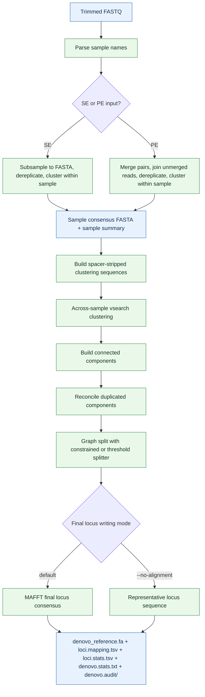

# Denovo

## Summary

`ipyrad2 denovo` builds a denovo pseudoreference FASTA from trimmed sample FASTQs when you do not have a suitable external reference genome. The goal is not to assemble a final dataset directly, but to construct a shared reference library from the data themselves so that later read mapping and assembly steps can proceed against locus references that are empirically supported by the samples.

This pipeline is designed around three distinct problems that naive clustering cannot solve well on its own. Within samples, raw reads contain redundancy and sequencing error, so denovo first reduces reads to sample-level consensus loci. Across samples, homologous loci can be divergent enough that a second clustering stage is needed to recover broader components. Those components can still contain duplicated sample representations caused either by true paralogy or by technical effects such as merged versus joined paired-read behavior, so denovo then applies reconciliation and graph-based splitting before writing final loci.

In the normal assembly workflow, `denovo` sits after [`trim`](./trim.md) and before [`map`](./map.md). Its main output is a pseudoreference FASTA that you can map reads against. It is not the final assembled dataset, and it does not replace the later [`Assemble`](./assemble.md) step.

## When to Use

Use `denovo` when:

- no suitable external reference genome exists
- the available reference is too divergent to use confidently for read mapping
- you want to build a shared pseudoreference from the data themselves before mapping and assembly

Do not use `denovo` when you already have a trusted reference FASTA that is appropriate for your samples. In that case, skip directly from [`trim`](./trim.md) to [`map`](./map.md).

## Workflow



## Prerequisites

- trimmed sample-level FASTQ files, usually from [`trim`](./trim.md)
- an activated `ipyrad2` environment
- executable `vsearch` and `mafft` binaries available either by explicit CLI path, in the active environment, or on `PATH`
- read access to the FASTQ files
- write access to the output directory

`denovo` accepts plain FASTQ and `.gz`-compressed FASTQ input. All inputs in one run must be consistently single-end or consistently paired-end.

For the current implementation, preflight still resolves both `vsearch` and `mafft` even if you select `--no-alignment`.

## Inputs and Sample Naming

Use `-d/--fastqs` with one or more FASTQ paths or glob patterns. You can pass explicit paths, shell-expanded globs such as `TRIMMED/*.fastq.gz`, or quoted glob patterns that `ipyrad2` expands internally.

Sample names are parsed from FASTQ filenames. In many datasets the default parser is enough, but if filenames contain extra provider, lane, or run tokens you can control parsing with:

- `-dx, --delim-str`: delimiter substring used to split the filename
- `-di, --delim-idx`: keep text left of the Nth delimiter, default `1`

These settings determine both:

- which files are grouped together as one sample
- which sample names are written into denovo outputs

For a worked example of delimiter-based naming, see [Using -dx and -di to pair and name samples](../recipes/sample-name-parsing.md).

## Command Patterns

The smallest useful run is:

```bash
ipyrad2 denovo -d TRIMMED/*.fastq.gz -o output-denovo
```

That tells `ipyrad2` to parse sample names from the FASTQ filenames, run the denovo clustering workflow, and write a curated pseudoreference output set to `output-denovo/`.

### Core Inputs

- `-d, --fastqs`: one or more FASTQ paths or glob patterns
- `-o, --out`: output directory, default `./output-denovo`
- `-f, --force`: overwrite denovo outputs created by this command

Without `--force`, `denovo` stops if curated denovo outputs already exist in the output directory.

### Clustering and Consensus

- `-s, --within-similarity`: within-sample clustering threshold, default `0.95`
- `-S, --across-similarity`: across-sample clustering threshold, default `0.85`
- `-m, --min-derep-size`: minimum duplicate count retained during dereplication, default `2`
- `-i, --min-length`: minimum retained sequence length after merge or join, default `35`
- `-g, --min-merge-overlap`: minimum overlap required to merge paired reads, default `20`
- `-e, --max-merge-diffs`: maximum mismatches allowed in the merged region, default `4`
- `--graph-splitter {threshold,constrained}`: graph refinement algorithm after duplicated-component reconciliation; default `constrained`
- `--no-alignment`: skip MAFFT in the final locus step and use the longest stripped sequence per locus

The final-stage choice matters biologically:

- default mode builds an aligned locus consensus for loci that require it
- `--no-alignment` is faster, but it writes a representative sequence rather than an aligned consensus

The graph splitter choice affects how duplicated graph components are resolved:

- `constrained`: sample-constrained maximum-spanning forest, now the default
- `threshold`: legacy ascending-PID sweep retained mainly for comparison and troubleshooting

### Sample Naming and Library Type

- `-b, --allow-reverse-complement`: cluster both strands rather than plus strand only
- `-dx, --delim-str`: delimiter used when parsing sample names
- `-di, --delim-idx`: index of the retained delimiter-split token

### Runtime and Binaries

- `-c, --cores`: maximum total cores to use, default `6`
- `-t, --threads`: threads per `vsearch` job, default `3`
- `--keep-intermediates`: retain the internal denovo working directory instead of cleaning it on success
- `--vsearch-binary`: explicit path to `vsearch`
- `--mafft-binary`: explicit path to `mafft`

`denovo` validates that `--threads` does not exceed `--cores` before launching work.

### Logging

- `-l, --log-level`: logging verbosity, default `INFO`

## How the Workflow Works

### 1. Preflight validation and binary resolution

Before it does any biological work, `denovo`:

- expands and parses FASTQ inputs into sample units
- validates that all parsed inputs are either single-end or paired-end
- validates numeric runtime and clustering arguments
- resolves `vsearch` and `mafft` from explicit CLI paths, then the active environment, then `PATH`
- checks output collisions and prepares the internal working directory

### 2. Within-sample `vsearch` processing

Each sample is processed independently first.

For paired-end input, `denovo`:

- merges overlapping read pairs
- joins the unmerged reads with a fixed spacer
- concatenates merged and joined products
- dereplicates them
- clusters them within sample with `vsearch`

For single-end input, `denovo`:

- converts reads to FASTA
- dereplicates them
- clusters them within sample with `vsearch`

This stage produces one sample-level consensus FASTA plus supporting clustering tables for each sample.

### 3. Sample summary construction

After within-sample clustering, `denovo` builds sample summaries from the sample consensus outputs. These summaries preserve the information needed later for final locus writing, including whether a record came from a joined or merged paired-read product. For across-sample clustering, denovo derives spacer-stripped clustering sequences from those summaries so that broad homology is judged on biological sequence rather than on the artificial join spacer used for unmerged pairs.

### 4. Across-sample clustering

The concatenated clustering FASTA is clustered across samples with `vsearch --usearch_global`. This produces an across-sample hit table describing which sample-level consensus records belong to the same broader component. At this stage, the goal is to recover permissive homologous components rather than final loci, so a single component may still contain more than one record from the same sample.

### 5. Duplicated-component reconciliation and graph splitting

Across-sample components can still contain duplicated relationships that are not appropriate to treat as one final locus. Some of those duplicates reflect true paralogs, while others arise from technical representation differences, especially joined versus merged paired reads. `denovo` therefore treats graph refinement as a separate stage rather than assuming the across-sample clustering output can be written directly.

In the current implementation, duplicated components are reconciled before splitting. Component-local alignment is used to evaluate whether duplicate sample records are compatible enough to be treated as technical duplicates rather than as separate loci. The refined graph is then split with one of two algorithms:

- `constrained`, the default, builds sample-unique subclusters by prioritizing strong compatible edges while preventing duplicate samples from accumulating in the same final locus
- `threshold`, the legacy alternative, sweeps PID thresholds upward and splits duplicated components more coarsely

This is a heuristic stage, not a perfect generative model of locus history. Its purpose is pragmatic: collapse technical duplicate representations where the evidence supports it, while still retaining extra copies in the pseudoreference when the graph suggests genuinely distinct loci.

### 6. Final locus writing

The last stage writes `denovo_reference.fa` from the ordered loci.

In the default mode:

- single-sequence loci are written directly
- loci whose stripped sequences are all identical are written directly
- loci that still require alignment are aligned with MAFFT and converted to a gap-aware consensus
- loci that preserve paired-read arm structure are written with a 50N spacer in the final pseudoreference so later mapping can respect the two-arm geometry of the locus

With `--no-alignment`:

- MAFFT is skipped entirely in the final locus step
- the representative locus sequence is written directly instead of an aligned consensus

Importantly, `--no-alignment` changes only the final writing stage. It does not disable within-sample clustering, across-sample clustering, duplicated-component reconciliation, or graph splitting.

The final stage now reports progress:

- `Aligning loci - total jobs: N` in the default MAFFT path
- `Writing loci - total jobs: N` in `--no-alignment` mode

## Outputs and Intermediates

`denovo` writes five curated outputs at the root of the output directory:

- `denovo_reference.fa`: the final pseudoreference FASTA used by downstream mapping
- `loci.mapping.tsv`: mapping from final loci to the contributing sample-level consensus records
- `loci.stats.tsv`: per-locus summary table for the final denovo loci
- `denovo.stats.txt`: human-readable run summary with inputs, parameters, binaries, runtime settings, and output paths
- `denovo.audit/`: compact audit files for duplicated, reconciled, or split components

During the run, `denovo` also uses an internal working directory:

- `_denovo_work/`

That directory contains intermediate files such as merged or joined reads, dereplicated FASTAs, sample consensus FASTAs, across-sample hit tables, and graph-derived locus tables. By default it is cleaned on success. Use `--keep-intermediates` if you want to inspect those files after the run.

`denovo.audit/` is retained independently of `_denovo_work/`. It is intended for empirical diagnosis of difficult graph cases without requiring full intermediates to be preserved. In particular, `loci.mapping.tsv` and `loci.stats.tsv` expose reconciliation-related metadata such as the reconciliation mode and final output form, while the audit directory records per-component membership and summary information for duplicated components that were evaluated during graph refinement.

## Runtime and Performance Notes

- `--cores` controls total concurrency across the run.
- `--threads` applies to the `vsearch` stage.
- In the current implementation, the final MAFFT stage chooses its own worker scheduling internally from `--cores` and the number of loci.
- The final locus-writing stage now shows a progress bar.
- `--no-alignment` is usually much faster on large datasets because it skips MAFFT entirely in the last stage.
- Graph refinement remains heuristic. Empirically difficult duplicated components can still require inspection in `loci.mapping.tsv`, `loci.stats.tsv`, and `denovo.audit/`.

Speed and biological conservatism trade off here:

- default mode is slower but produces aligned locus consensuses where needed
- `--no-alignment` is faster but writes longest-sequence representatives instead of aligned consensuses

## Common Failures and Interpretation Notes

### No FASTQ inputs are parsed

If `-d` does not resolve to usable FASTQ files, `denovo` stops before running. Check the path or glob first.

### Mixed single-end and paired-end inputs

One run must be consistently SE or consistently PE. Mixed layouts are rejected.

### Sample names are parsed incorrectly

If files collapse into the wrong samples, or mates are not grouped as expected, adjust `-dx` and `-di`.

### `threads` exceeds `cores`

`denovo` validates this before running. Reduce `--threads`, increase `--cores`, or both.

### Invalid clustering or merge parameters

`denovo` validates the similarity thresholds and length or overlap settings before launching work. For example:

- similarity thresholds must be greater than `0` and less than or equal to `1`
- dereplication size and minimum lengths must be at least `1`
- maximum merge differences must be at least `0`

### `vsearch` or `mafft` cannot be found

The runner resolves binaries from explicit CLI paths, then the active environment, then `PATH`. If a binary is missing or not executable, preflight stops before clustering begins.

### Existing outputs already exist

If curated denovo outputs already exist in the output directory, `denovo` stops unless you provide `--force`.

### Denovo output is not the final project output

`denovo_reference.fa` is a pseudoreference for mapping. It is not the final assembled HDF5, VCF, or loci dataset. The normal next step is [`map`](./map.md), followed by [`Assemble`](./assemble.md).

## Examples

### Basic denovo pseudoreference build

```bash
ipyrad2 denovo -d TRIMMED/*.fastq.gz -o output-denovo
```

### Use custom similarity settings and more concurrency

```bash
ipyrad2 denovo -d TRIMMED/*.fastq.gz -o OUT -s 0.95 -S 0.85 -c 12 -t 3
```

### Select the graph refinement algorithm explicitly

```bash
ipyrad2 denovo -d TRIMMED/*.fastq.gz -o OUT --graph-splitter constrained
```

### Use delimiter-based sample naming

```bash
ipyrad2 denovo -d TRIMMED/*.fastq.gz -o OUT -dx _R -di 1
```

### Keep intermediate files for inspection

```bash
ipyrad2 denovo -d TRIMMED/*.fastq.gz -o OUT --keep-intermediates
```

### Skip final alignment and write longest-sequence representatives

```bash
ipyrad2 denovo -d TRIMMED/*.fastq.gz -o OUT --no-alignment
```

## Related Pages

- [Quick Guide](./index.md)
- [trim](./trim.md)
- [map](./map.md)
- [Assemble](./assemble.md)
