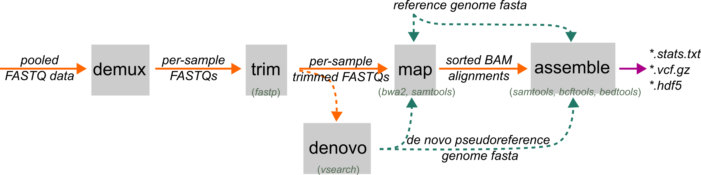

# Assembly Guide

The ipyrad2 assembly workflow involves running a sequence of subcommands, as shown below.

{ width="100%" }

## Standard Example

The most common workflow starts with pooled RAD reads and ends with assembled loci, variants, and an HDF5-backed dataset:

```bash
# 1. demultiplex pooled reads into sample files
ipyrad2 demux -d RAW/*.fastq.gz -b barcodes.tsv -o FASTQs/ -c 10 -t 2

# 2. trim sample reads for quality, adapters, and cutsite motifs
ipyrad2 trim -d FASTQs/*.fastq.gz -o TRIMMED/ -c 10 -t 2

# 3. map reads to a reference genome
ipyrad2 map -d TRIMMED/*.fastq.gz -r REF.fa -o BAMS/RAD -c 10 -t 2

# 4. assemble loci and call variants
ipyrad2 assemble -d BAMS/RAD/*.bam -r REF.fa -o OUT -m 4 -qm 20 -c 10 -t 2
```

If you also have whole-genome BAMs mapped to the same reference, they can join at the final stage:

```bash
ipyrad2 assemble -d BAMS/RAD/*.bam -w BAMS/WGS/*.bam -r REF.fa -o OUT -m 4 -qm 20
```

That mixed run is useful because the RAD samples still define the loci while WGS samples contribute information inside those same RAD-defined windows.

## Step by Step

1. Start with [demux](./demux.md) if your reads are still pooled by lane or library.
2. Continue to [trim](./trim.md) to prepare sample FASTQs.
3. Use [denovo](./denovo.md) only if you do not have a suitable external reference and need a pseudoreference first.
4. Use [map](./map.md) to map trimmed reads to either an external reference or a denovo-derived pseudoreference.
5. Finish with [assemble](./assemble.md), which defines loci from RAD BAMs, calls variants, and writes the assembled outputs.

## Alternate Entry Points

- If your reads already arrive split by sample, skip `demux` and begin at [trim](./trim.md).
- If your reads are already trimmed and you have a reference, start at [map](./map.md).
- If you already have mapped BAMs, start directly at [Assemble](./assemble.md).
- If no suitable reference exists, use [denovo](./denovo.md) before mapping.
- WGS does not replace the RAD path in the current workflow. WGS BAMs can be added only at [assemble](./assemble.md), and only inside loci defined by the RAD samples.

## What You Get

The main outputs of the assembly workflow are:

- an assembled HDF5 database
- a filtered VCF
- BED intervals for loci
- locus-oriented sequence outputs such as `.loci`

From there you can either move to [Writing Outputs](../writing-outputs/index.md) for exported windows, loci, or SNP datasets, or continue to the [Analysis Guide](../analyses/index.md) for downstream methods that run on assembled or SNP-capable HDF5 data.
